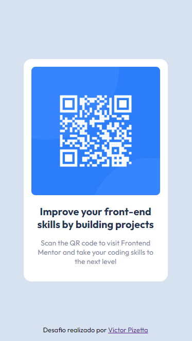
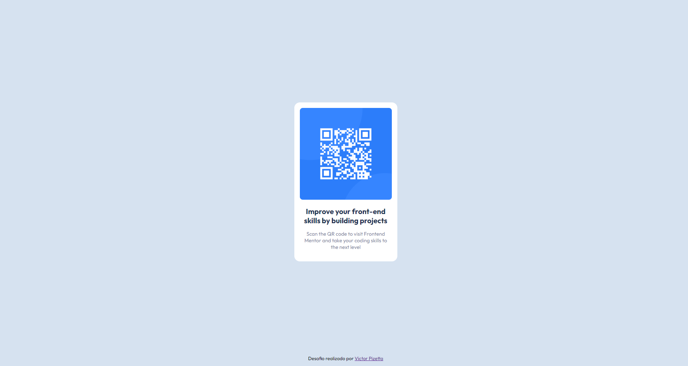

<h1 align="center"> Desafio QR code </h1>

Desafio do QR code proposto pela Frontend Mentor.
 
<a href="https://www.frontendmentor.io/challenges/qr-code-component-iux_sIO_H">Tente realizar o seu clicando aqui.</a>

  <a href="#-tecnologias">Tecnologias</a>&nbsp;&nbsp;&nbsp;|&nbsp;&nbsp;&nbsp;
  <a href="#-projeto">Projeto</a>&nbsp;&nbsp;&nbsp;|&nbsp;&nbsp;&nbsp;
  <a href="#-layout">Layout</a>

 

<table>
    <thead>
        <td>
        <b>Mobile</b>
        </td>
        <td>
        <b>Desktop</b>
        </td>
    </thead>
    <tr>
        <td>
        
        </td>
        <td>
        
        </td>
    </tr>
</table>
 

## 🚀 Tecnologias

Esse projeto foi desenvolvido com as seguintes tecnologias:

- HTML e CSS
- Git e Github
- Figma
   

## 💻 Projeto

O desafio tem a proposta de colocar em prática tudo que venho estudando sem o auxílio de nenhuma aula específica.

- [Veja como ficou o meu projeto!](https://victorpz.github.io/desafio-frontendMentor-QRcode)

## 🔖 Layout

Você pode visualizar o layout do projeto no próprio site do desafio (pelo figma se for premium ou por imagens disponibilizadas por eles se for free).

---

Feito com ♥ por [Victor Pizetta](https://www.linkedin.com/in/jvictor-pizetta/)
